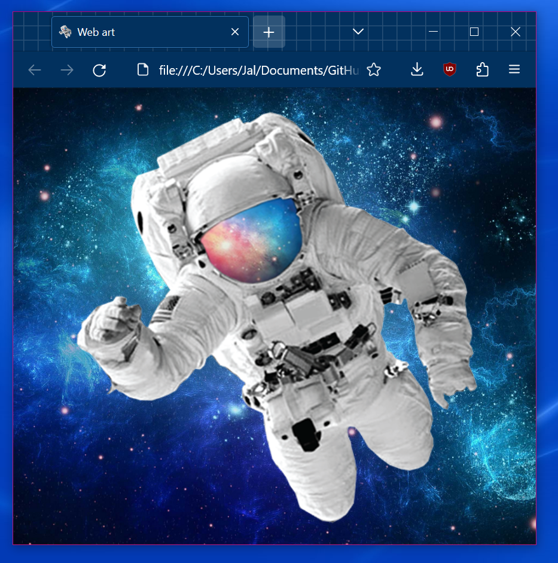

# Estudos em HTML e CSS

## Sobre
Criei este repositório para registrar meus primeiros passos com desenvolvimento web.
Os códigos foram feitos com base no <a href="https://github.com/gustavoguanabara/html-css/tree/master/aulas-pdf" target="_blank">Curso em Vídeo: HTML5 e CSS3</a>.

## Status
Projetos 1,2 e 4 concluídos  
Projeto 3 em revisão.  

## Tecnologias utilizadas
- HTML / CSS / Javascript
- VSCode
- Github

## Projetos

### Mini projeto 1: webart de astronauta

### Projeto 1: site de curiosidades
### Projeto 2: poesia de cordel
### Projeto 3: mostrando prévia de redes sociais
### Projeto 4: tela de login

