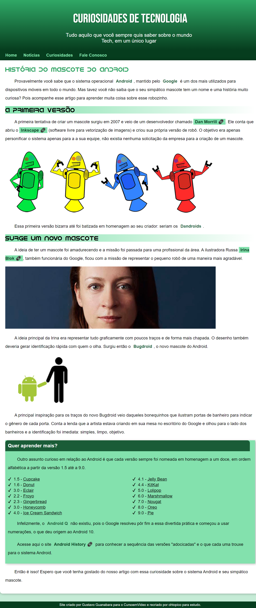

# Esudos em HTML e CSS

Criei este repositório para registrar meus primeiros passos com desenvolvimento web.

Os códigos foram feitos com base no <a href="https://github.com/gustavoguanabara/html-css/tree/master/aulas-pdf">Curso em Vídeo: HTML5 e CSS3</a>.

## Projeto 1: site de curiosidades

